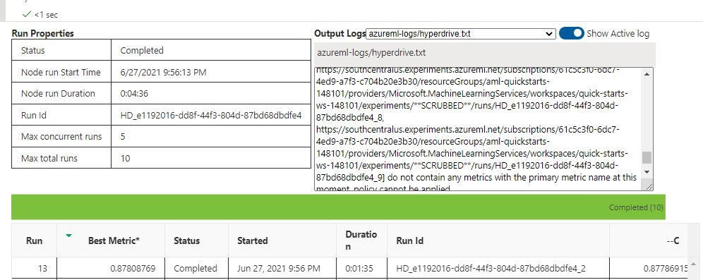

# Insurance Crosssell Capstone

The project uses Insurance Crosssell  Dataset in azure workspace to train models using both Hyperdrive and AutoML.  The best model is determined and then a endpoint is created and tested using python sdk. The project was implemented using VS code and Azure Machine Learning Studio. 

# Project Architecture 
Below is a high level overview of the project architecture.  

## Project Set Up and Installation
The project requires access to a Azure Machine Learning account and the crosssell dataset.  Link to the dataset is provided later in this document.

## Dataset

### Overview
Each row in the dataset represents a policy holder with the insurance company that is a potential sale of the companies car insurance product.  
The data includes:
    * Customer demographics 
    * Age and condition of the customers vehicle 
    * Is the customer a current policy holder 

### Task
Ths client is an Insurance company that has provided Health Insurance to its customers now they want a model to predict whether the policyholders (customers) from past year will also be interested in Vehicle Insurance provided by the company.

### Access
Data is accessed via a dataset after it is downloaded from Kaggle and uploaded into the Azure ML studio. 
Raw data can be accessed here <a href = "https://www.kaggle.com/anmolkumar/health-insurance-cross-sell-prediction">Crosssell Dataset</a>

The process for creating the dataset is shown below the ML studio allows for the upload of files and creation of a named dataset. 

Once the process is completed then you can use code shown below to access the registered dataset. 

## Automated ML
In order to setup the automl run the following tasks were performed:

* Specify the primary_metric: The metric that will be used is Accuracy.  We want to select the model that will most accurately predict if the customer will be interested in the car insurance
* Set experiment_timeout_minutes (20): In order to limit consumed resources we set a max time out for the experiment. 
* Enable_early_termination (True):  Abandon models that are not more accurate than currently completed models
* Max_concurrent_iterations (5): Represents the maximum number of iterations that would be executed in parallel
 Below is a screeen shot of the run widget as the run was performed. 
 

### Results
*TODO*: What are the results you got with your automated ML model? What were the parameters of the model? How could you have improved it?
Below shows the results of our run.  As you can see our primary metric (Accuracy) varies by the model tested. Also included is a screen shot of the best model complete
with parameters. The bottom screen shot shows hyper parameters used with the model.  

Below is the completed run with Id. 

### Primary Parameter (Best AutoML Model)
Accuracy: 72.1%

### Feature Evaluation

When elements of the data were examined it was found that a single feature was found to have an outsized impact on the likelyhood of a customer purchase. 

## Hyperparameter Tuning
The model choosen for the hyperparameter run is Logistic Regression. In order to setup the run there were several tasks that need to be performed. 

Setup the following 
* RandomParameterSampling setup:  This was selected because it would allow the range of values selected for the run.  It also supports early termination of a runs that are underperforming. 
* BanditPolicy Setup :  Bandit terminates any runs where the primary metric is not within the specified slack factor compared to the best performing run.
* max_concurrent_runs (5): The maximum number of runs to execute in parallel.
* max_total_runs (10): The maximum total number of runs to create. 

### Results

Below shows the different runs in the hyperparameter search space.  Note that each run shows the different parameters used for that run.  

Best Model Screen Shot with Parameters

### Things to improve
* Convert model to onyx so that it can be easily shared. 
* Review the fairness of the models. 
* Do additional testing on the hyperdrive run to see if a larger dataset results in the same accuracy -- when this is available. 

## Model Deployment
As can be seen above the hyperdrive model was seen to be the most accurate. In fact the hyperdrive model was highly consistent across a wide range of hyperparameters. In discussing this with one of the mentors they indicated that the runs had completed and that the model was just very well suited for this dataset. In order to complete the lab I deployed the hyperdrive model and then tested the endpoint.  

There were three key elements of the deployment. 

* Inference Script:  The inference script describes how to configure the model to make predictions. It references the scoring script (entry_script property) and is used to locate all the resources required for the deployment. In short inference script is used to define the software dependencies needed for the deployment.  
* Environment which defines the dependencies needed to execute the model. These requirments are defined in the project environment.yml file. This is passed in as part of the inference script properties 
* Scoring script this script contains the python code required to accept a request for a prediction and return the models response.  This code can be found in the score.py file.  
The model was deployed through use of the Python SDK.  Below is a screen shot of the code used to deploy the model 

Once deployed below is the process for testing the model. The defined endpoint is sent a json formatted data and a result is returned.  

## Screen Recording
<a href = "http://somup.com/cr1uf9qPl4">Screen Cast</a>

## Standout Suggestions
* I added support for application insights,  this is a valuable tool for evaluating issues with an endpoint. 
